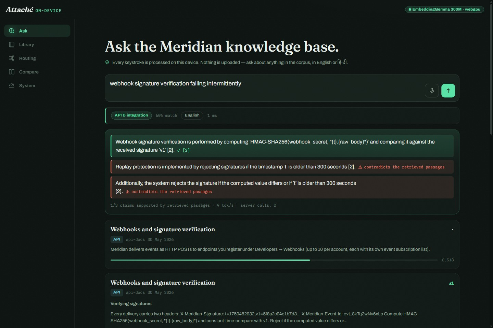
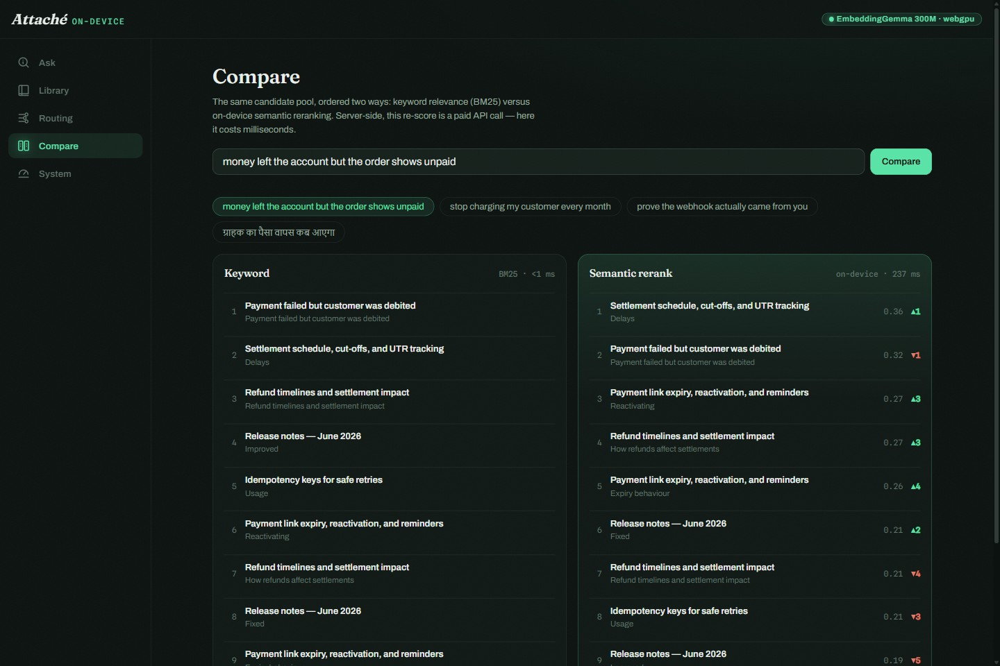
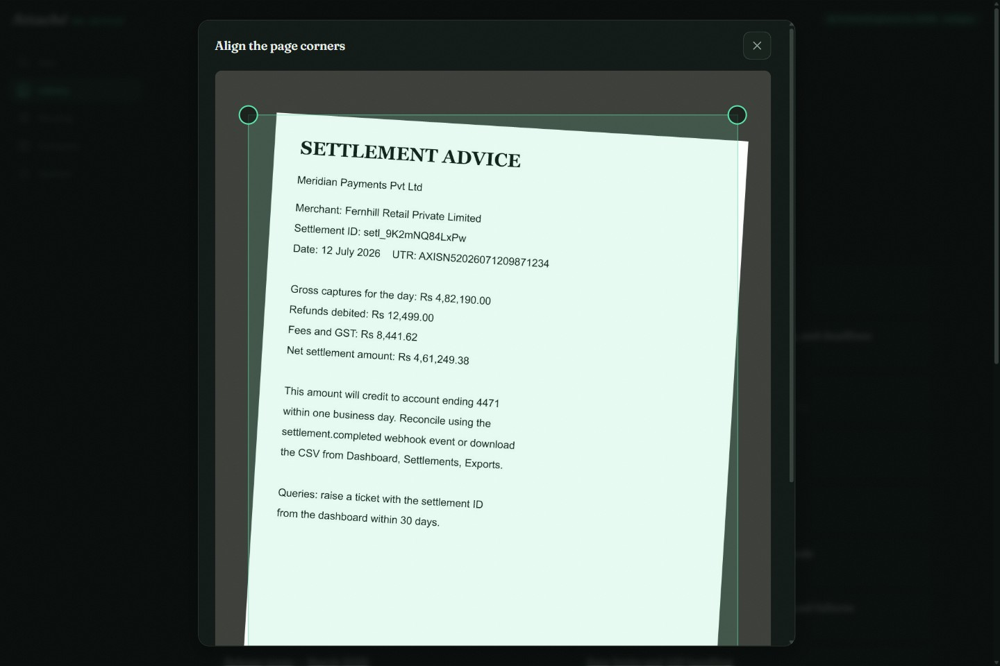
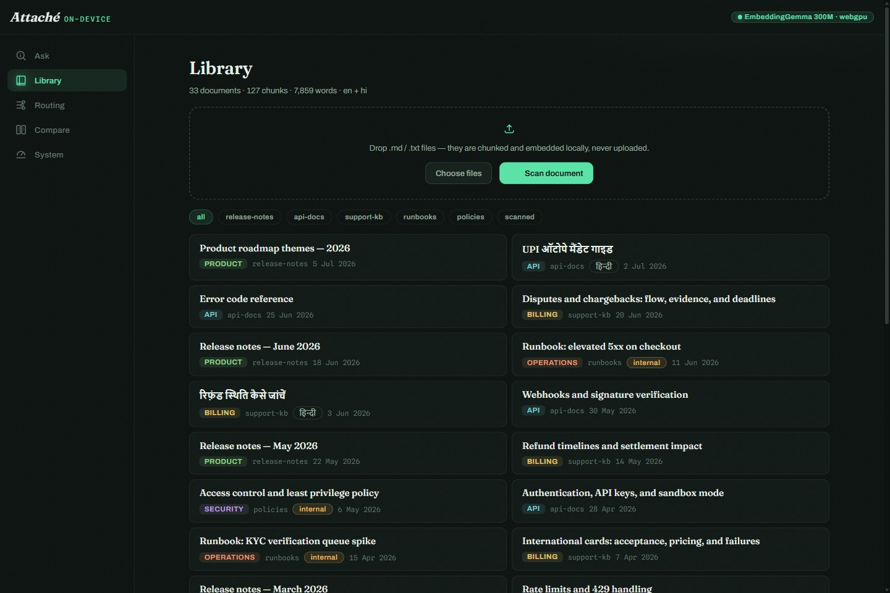
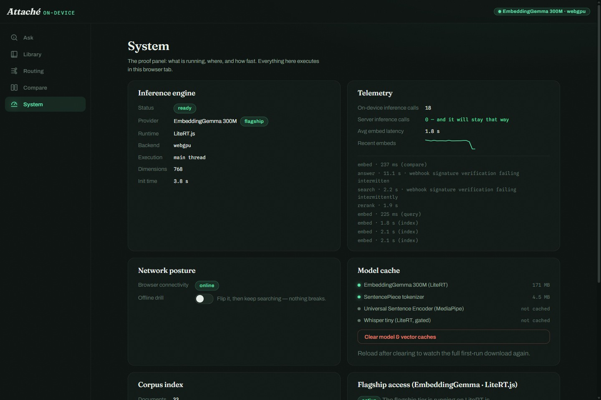
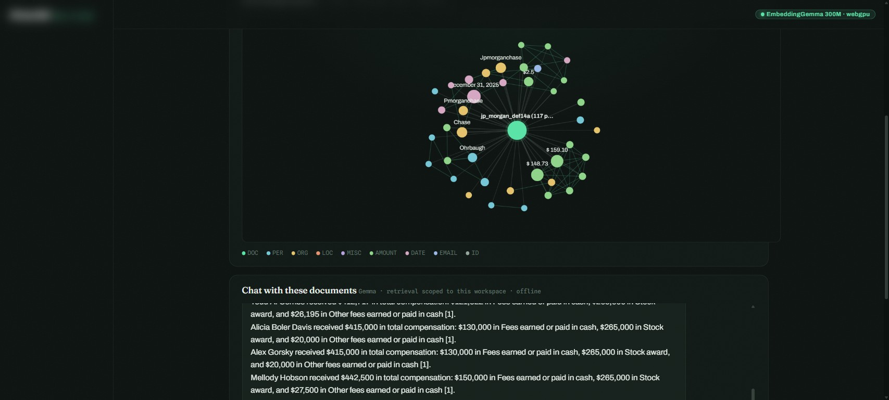
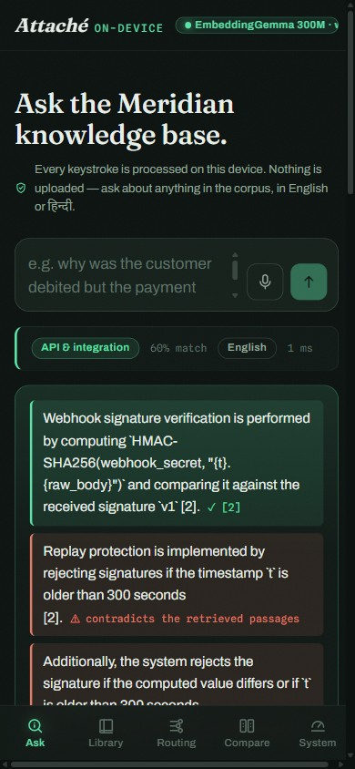

# Attaché — a fully on-device research copilot

A production-grade demo of **LiteRT.js** (Google's browser inference runtime): drop documents
in, ask questions — by keyboard or voice — and watch a five-model pipeline (recall →
cross-encoder rerank → Gemma answer → NLI claim verification) run **entirely inside the
browser tab**. No inference server, no API key, no upload.



*The headline feature: Gemma drafts a cited answer while an NLI model verifies every
sentence against its cited passage — green ✓ with entailment %, red ⚠ when a claim
contradicts (or cites the wrong chunk of) the retrieved evidence. `server calls: 0`.*

The bundled corpus is the knowledge base of *Meridian*, a fictional payments platform
(32 documents: support KB, API docs, incident runbooks, security policies, release notes —
English + हिन्दी).

## Gallery

| | |
| --- | --- |
|  *Compare: BM25 order vs on-device semantic rerank, with rank-movement deltas* |  *Scan: photo → draggable corner quad → homography dewarp → OCR → indexed* |
|  *Library: bundled corpus + drag-drop uploads + scanned documents, filterable* |  *System: live provider/backend truth, model cache, telemetry, offline drill* |



*Workspace on a real 117-page SEC proxy statement: PDF → 400 chunks embedded → typed
knowledge graph — then "List all the directors and what compensation each of them received"
answered from the compensation table with per-director cash/stock/other breakdowns whose
arithmetic checks out, cited, entirely in the browser.*



*Mobile-first: the same pipeline behind a bottom-nav layout at 390 px.*

## Views

| View | What it demonstrates |
| --- | --- |
| **Ask** | The full verified-RAG pipeline: embed → zero-shot triage gate → semantic recall → **cross-encoder rerank** → optional **Gemma answer with live NLI claim verification** (green ✓ entailed / amber ~ unconfirmed / red ⚠ contradicted). Pipeline inspector shows every stage's status and ms. |
| **Library** | The corpus, filterable by collection; drag-drop `.md`/`.txt` — or **Scan**: camera/photo → corner alignment → homography dewarp → OCR → indexed, all on-device |
| **Workspace** | A private analysis room: drop up to 5 documents (`.pdf`/`.md`/`.txt`) → embedded + entities extracted (DistilBERT NER + patterns) → **live knowledge graph** (d3-force) → chat with the set via Gemma, retrieval scoped to those docs only. Verified against a 117-page SEC proxy statement. |
| **Routing** | The triage classifier, live-editable: change labels/exemplars, rebuild prototypes in ms, test any query |
| **Compare** | The same candidate pool ordered by keyword (BM25) vs. on-device semantic rerank, with rank-movement deltas |
| **System** | Active provider/backend, model cache, telemetry, offline drill toggle |

## The model fleet (all on-device)

| Stage | Model | Size | Runtime |
| --- | --- | --- | --- |
| Recall | EmbeddingGemma 300M | 179 MB | LiteRT.js · WebGPU |
| Precision rerank | ms-marco-MiniLM-L6 cross-encoder | 23 MB | LiteRT.js · XNNPACK |
| Answer | gemma-4-E2B-it (web .task) | 2 GB | MediaPipe GenAI |
| Claim verification | DistilBERT-MNLI | 68 MB | LiteRT.js · XNNPACK |
| Entity extraction | DistilBERT-NER (+ pattern rules) | 66 MB | LiteRT.js · XNNPACK |
| OCR | Tesseract (LiteRT PaddleOCR slot config-gated) | ~15 MB | WASM |
| PDF text | pdf.js (bundled worker) | — | WASM |

The cross-encoder and NLI are converted from PyTorch by `scripts/convert-models.py`
(TFLite dynamic-range int8) with score-parity checks against the reference — a conversion
only ships if quantized logits stay close AND preserve ranking. Both pass (max logit diff
0.07 / 0.30, ranking preserved). Note: int8 hybrid ops must run on the `wasm` accelerator —
the WebGPU delegate's CPU fallback trips "Asyncify is not defined".

Past 20k chunks an HNSW index (0.98 recall vs brute force in tests) takes over from exact
scanning automatically (`retrieval.config.js → ann`).

## Architecture

```
UI (React 19, zustand) ── embedClient RPC ──▶ Web Worker
                                              ├─ litert provider    EmbeddingGemma 300M (.tflite) — WebGPU→WASM
                                              ├─ mediapipe provider Universal Sentence Encoder — safety net
                                              └─ lexical provider   hashed BoW — degraded/CI mode
Stores: Cache API (model weights) · IndexedDB (chunk vectors, user docs) · in-memory BM25
```

- **Config-driven**: every model URL, provider chain, routing label, chunk size and threshold
  lives in `src/config/*.config.js`. Components read config; nothing hardcodes.
- **Provider chain with honest degradation**: LiteRT flagship → MediaPipe standard → lexical
  fallback. The System view names which tier is actually running — no pretending.
- **ASR**: push-to-talk. Whisper-tiny via LiteRT is config-gated (`asr.whisper.enabled`)
  until its export signature is verified with `@litertjs/model-tester`; the Web Speech
  fallback is labelled as possibly-cloud on Chrome.
- **Gemma capstone**: `features.answer` + `llm.gemma.modelUrl` enable grounded answer
  synthesis via MediaPipe GenAI (LiteRT runtime). Off by default — multi-GB weights.

## Develop

```bash
npm install        # postinstall copies WASM runtimes into public/wasm/
npm run dev        # http://localhost:5173 (serves COOP/COEP headers)
```

First load downloads model weights into the Cache API; every later load is instant and
offline-capable. If a tier fails to start, the chain drops to the next and the System view
reports exactly why.

### Unlocking the flagship tier (EmbeddingGemma · LiteRT.js)

The `litert-community/embeddinggemma-300m` repo is **license-gated** on Hugging Face.
One-time setup:

1. Sign in to huggingface.co, accept the Gemma licence on the model page, and create a
   free **read** token.
2. Put it in `.env` (gitignored): `HF_TOKEN=hf_…`
3. `node scripts/download-models.mjs` — pulls the weights (~179 MB) + tokenizer into
   `public/models/` (gitignored), which the app serves **same-origin**: no token in the
   browser, fully offline-capable.

Verified live: EmbeddingGemma 300M compiles on **WebGPU**, Hindi triage classifies
properly (multilingual), and semantic quality visibly jumps (e.g. "customer paid twice"
retrieves the idempotency-keys doc). Without the weights the app runs on the standard
tier (Universal Sentence Encoder, ~7 MB, ungated) — functional but English-centric.

## Test

```bash
npm test                 # vitest — 34 unit tests over the ML core & pipeline logic
```

Covered: frontmatter parsing, chunking (heading boundaries, overlap, runt-merge, template-stripped
edge cases), BM25 (incl. Devanagari tokenisation), vector store (topK, serialization), the lexical
provider, locale detection, upload normalisation. Not yet automated: browser e2e (verified
manually via Playwright), the gated LiteRT flagship path, Whisper ASR.

## Stress-test with a real large corpus

The bundled corpus is 32 docs. To evaluate at production scale, import any markdown
documentation tree (github/docs-style frontmatter + Liquid handled automatically):

```bash
git clone --depth 1 --filter=blob:none --sparse https://github.com/github/docs /tmp/gh-docs
cd /tmp/gh-docs && git sparse-checkout set content/actions content/billing content/authentication
node scripts/import-corpus.mjs /tmp/gh-docs/content   # → src/data/corpus-ext/ (gitignored)
```

Measured on the standard tier (USE, wasm/xnnpack, main thread): **373 docs · 3,328 chunks ·
261k words** index in ~75 s on first boot (then restored from IndexedDB in <1 s), and queries
run end-to-end in **~25–30 ms** (embed ~20 ms · triage <1 ms · brute-force scan over
3,328×100 dims ~5–7 ms). Delete `src/data/corpus-ext/` to return to the demo corpus.

## Deploy (Docker → FastAPI)

The bundle is static; the container serves it with a small **FastAPI/uvicorn** server
(`deployment/server.py`) that sets the cross-origin-isolation headers LiteRT.js needs —
the same service shape as a Cloud Run SPA server.

```bash
npm run docker:up            # build + run at http://localhost:8080
# or
npm run docker:build
docker run -p 8080:8080 attache:local

# Cloud Run
gcloud builds submit --config deployment/cloudbuild.yaml .
```

## Project layout

```
src/
├── config/        app / models / routing / retrieval — all knobs live here
├── ml/            modelCache, chunker, bm25, vectorStore, persistence,
│   ├── embedding/ litert · mediapipe · lexical providers
│   ├── tokenizer/ sentencepiece adapter (loads the checkpoint's own model)
│   └── workers/   embed.worker.js — owns compilation & tensors
├── services/      engine boot, corpus, search pipeline, dictation
├── state/         zustand store
├── components/    shell, cards, primitives, icons
├── views/         Ask · Library · Routing · Compare · System
└── data/corpus/   32-doc Meridian knowledge base (+ manifest.json)
deployment/        Dockerfile · server.py (FastAPI) · compose · cloudbuild
```
